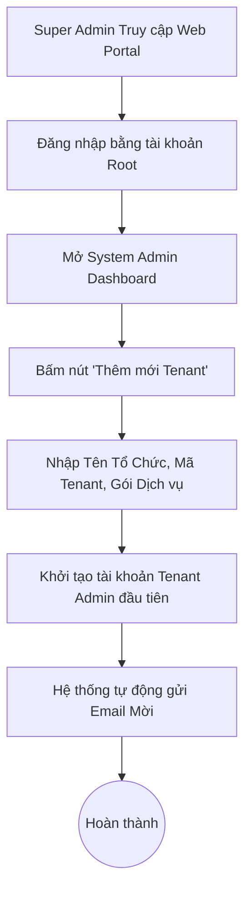

---
stepsCompleted:
  - step-01-init
  - step-02-discovery
  - step-03-core-experience
  - step-04-emotional-response
  - step-05-inspiration
  - step-06-design-system
  - step-07-defining-experience
  - step-08-visual-foundation
  - step-09-design-directions
  - step-10-user-journeys
  - step-11-component-strategy
  - step-12-ux-patterns
  - step-13-responsive-accessibility
inputDocuments:
  - _bmad-output/planning-artifacts/prd.md
  - docs/idea.md
---

# UX Design Specification eam-enterprise-assset-management

**Author:** Admin
**Date:** 2026-05-13

---

<!-- UX design content will be appended sequentially through collaborative workflow steps -->

## Executive Summary

### Project Vision

EAM là nền tảng SaaS B2B quản lý vòng đời tài sản vật lý đa ngành (sản xuất, y tế, logistics...). Hệ thống hướng tới việc giảm downtime và tối ưu chi phí bảo trì thông qua việc số hóa quy trình quản lý bằng Web Portal cho cấp quản lý và Mobile App ưu tiên hoạt động offline (offline-first) dành cho kỹ thuật viên tại hiện trường.

### Target Users

1. **Technician (Kỹ thuật viên hiện trường):** Sử dụng Mobile App. Thường xuyên di chuyển, đôi khi làm việc ở vùng sóng yếu hoặc mất sóng (như tầng hầm). Cần thao tác nhanh gọn (scan QR, tick checklist, chụp ảnh) thay vì phải nhập liệu văn bản dài.
2. **Asset Manager (Quản lý tài sản):** Sử dụng Web Portal. Xử lý khối lượng dữ liệu lớn, cần thao tác tạo tài sản, quản lý phân cấp tài sản (hierarchy) sâu và lên lịch bảo trì phòng ngừa (PM) một cách trực quan và nhanh chóng.
3. **Supervisor (Giám sát bảo trì):** Sử dụng Web Portal. Cần cái nhìn tổng quan theo thời gian thực (dashboard) để theo dõi tiến độ công việc, xử lý cảnh báo rò rỉ/hỏng hóc và điều phối lại công việc (reassign) khi có nút thắt.
4. **Tenant Admin (Quản trị viên tổ chức):** Cần luồng thiết lập (onboarding) cấu trúc tài sản đặc thù theo ngành và phân quyền (RBAC) dễ hiểu, an toàn.

### Key Design Challenges

- **Trải nghiệm Offline/Online liền mạch (Mobile):** Làm sao để kỹ thuật viên luôn an tâm rằng dữ liệu đã được lưu khi mất mạng, và giao diện đồng bộ (sync) phải hoạt động ngầm trơn tru mà không cản trở công việc hiện tại.
- **Quản lý cấu trúc cây tài sản phức tạp (Web):** Thiết kế UI hiển thị dạng Cây (Tree/Hierarchy) để duyệt, tìm kiếm và thao tác trên hàng ngàn tài sản mà không gây rối mắt, đồng thời đảm bảo hiệu suất phản hồi nhanh (< 2s).
- **Tính khái quát đa ngành:** Giao diện cần đủ linh hoạt để phục vụ thông tin từ thiết bị phẫu thuật trong y tế đến máy phay CNC trong nhà máy mà không khiến màn hình trở nên lộn xộn bởi quá nhiều trường dữ liệu thừa.

### Design Opportunities

- **Trải nghiệm "Scan-to-action" (Mobile):** Tận dụng tối đa camera. Chỉ với 1 lần quét mã QR, giao diện lập tức hiển thị Work Order liên quan và trạng thái tài sản, giảm số lượt chạm màn hình xuống mức tối thiểu.
- **Tự động hóa trực quan (Web):** Biến việc lập lịch bảo trì thành thao tác kéo thả trên Calendar/Timeline, mang lại trải nghiệm "autopilot" (tự động lái) cho Asset Manager.
- **Dashboard tương tác nhanh (Web):** Giúp Supervisor không chỉ xem báo cáo thụ động mà có thể thao tác (ví dụ: gán việc, duyệt) trực tiếp ngay trên các thẻ cảnh báo rủi ro/chậm trễ.

## Core User Experience

### Defining Experience

Trải nghiệm cốt lõi của EAM xoay quanh hai luồng tương tác chính, đại diện cho hai môi trường làm việc khác biệt:
1. **Tại hiện trường (Field):** Kỹ thuật viên (Technician) di chuyển liên tục, dùng ứng dụng di động quét mã QR, thực hiện checklist bảo trì và chụp ảnh báo cáo một cách nhanh gọn, bất chấp tình trạng kết nối mạng.
2. **Tại văn phòng (Office):** Quản lý tài sản (Asset Manager) và Giám sát (Supervisor) xử lý khối lượng lớn dữ liệu, cấu trúc cây phức tạp qua Web Portal để lập lịch bảo trì tự động và theo dõi tiến độ theo thời gian thực.

### Platform Strategy

- **Mobile App (Flutter):** Dành riêng cho Kỹ thuật viên. Giao diện ưu tiên cảm ứng (touch-first), tận dụng tối đa phần cứng thiết bị (camera để quét mã QR và chụp ảnh) và được kiến trúc để hoạt động hoàn hảo ở chế độ ngoại tuyến (offline-first).
- **Web Portal (React/Vite):** Dành cho cấp Quản lý và Quản trị viên. Giao diện tối ưu cho màn hình lớn, chuột và bàn phím (mouse/keyboard). Cần xử lý hiển thị mượt mà cấu trúc dữ liệu dạng cây sâu (deep hierarchy tree) và bảng điều khiển, lịch tương tác mật độ cao.

### Effortless Interactions

- **Scan-to-Action:** Kỹ thuật viên không cần gõ mã tài sản hay mã Work Order. Việc đưa điện thoại lên quét mã QR phải lập tức điều hướng chính xác đến màn hình công việc cần xử lý.
- **Invisible Background Sync:** Việc lưu trữ tạm dữ liệu khi mất kết nối và đẩy lên server khi có mạng lại phải diễn ra hoàn toàn tự động ngầm. Kỹ thuật viên không cần quan tâm đến nút "Đồng bộ" thủ công.
- **Auto-Scheduling:** Quản lý chỉ cần thiết lập chu kỳ bảo trì (ví dụ: mỗi 500 giờ), hệ thống sẽ tự sinh các Work Order và trải đều trên Lịch (Calendar) mà không cần theo dõi thủ công.

### Critical Success Moments

- **Khoảnh khắc "Tin cậy" của Technician:** Hoàn thành xong một Work Order bảo trì dài dưới tầng hầm (không sóng mạng), và khi đi thang máy lên mặt đất, ứng dụng thông báo tinh tế ✅ *"Đã đồng bộ thành công"* mà không mất một dòng dữ liệu nào.
- **Khoảnh khắc "Nhẹ gánh" của Asset Manager:** Lên lịch bảo trì phòng ngừa (PM) cho hàng chục thiết bị và ngay lập tức thấy chúng tự động phân bổ một cách thông minh, không bị quá tải trên Lịch bảo trì tổng.
- **Khoảnh khắc "Kiểm soát" của Supervisor:** Đang xem Dashboard, phát hiện ngay hình ảnh một khớp nối bị rỉ sét do kỹ thuật viên vừa tải lên, và tạo ngay một Work Order xử lý khẩn cấp (follow-up) chỉ với 2 click chuột.

### Experience Principles

1. **Offline Resilience First:** Ứng dụng mobile luôn xem trạng thái "không có mạng" là bình thường, không làm gián đoạn luồng thao tác của người dùng.
2. **Minimal Data Entry:** Mọi thao tác đều ưu tiên quét (scan), chọn (tick/dropdown), vuốt (swipe). Tuyệt đối hạn chế việc bắt người dùng tại hiện trường phải gõ văn bản dài.
3. **Automated Visibility:** Các tiến trình tự động hóa (như auto-scheduling) phải được hiển thị một cách trực quan, minh bạch để người dùng ở văn phòng luôn có cảm giác làm chủ hệ thống.

## Desired Emotional Response

### Primary Emotional Goals

1. **Tin cậy & An tâm (Trust & Relief):** Dành cho Kỹ thuật viên (Technician) khi họ biết chắc chắn rằng công sức và dữ liệu nhập vào luôn được lưu lại an toàn, dù làm việc ở môi trường khắc nghiệt không có kết nối mạng.
2. **Làm chủ & Kiểm soát (In Control & Calm):** Dành cho Quản lý tài sản (Asset Manager) và Giám sát (Supervisor). Khi đối mặt với hàng ngàn tài sản và lịch bảo trì chằng chịt, hệ thống mang lại cảm giác mọi thứ đang vận hành trơn tru và dễ dàng can thiệp ngay lập tức khi có sự cố.

### Emotional Journey Mapping

- **Khi mới tiếp cận (Onboarding):** Cảm thấy "Thật trực quan!" (Intuitive) - Không cần đọc tài liệu hướng dẫn dài dòng vẫn biết cách tạo một Work Order hay quét mã QR.
- **Trong quá trình thao tác (Core Action):** 
  - *Trên Mobile:* Cảm giác "Nhanh gọn" (Efficient) - Chỉ cần quét, vuốt và chạm, giải phóng đôi tay.
  - *Trên Web:* Cảm giác "Bao quát" (Comprehensive) - Mọi thông tin gom về một màn hình Dashboard/Tree mạch lạc, không lộn xộn.
- **Khi mất kết nối mạng (Offline phase):** Cảm giác "Vững tâm" (Confident) - Nhìn thấy chỉ báo "Đang lưu cục bộ" rất rõ ràng, không hoang mang sợ mất công làm lại.
- **Khi hoàn thành công việc:** Cảm giác "Thành tựu" (Accomplished) - Nhận được phản hồi thị giác tích cực (ví dụ: tick xanh, hiệu ứng hoàn tất tinh tế).

### Micro-Emotions

- **Tự tin (Confidence) vs. Hoang mang (Confusion):** Giao diện mobile luôn chỉ rõ hành động tiếp theo cần làm là gì (ví dụ: Nút "Bắt đầu công việc" luôn nổi bật nhất).
- **Thỏa mãn (Satisfaction) vs. Bực dọc (Frustration):** Cảm giác mượt mà khi kéo thả (drag & drop) một tài sản vào đúng vị trí trong cây phân cấp khổng lồ trên Web Portal mà không bị giật lag.
- **Tin tưởng (Trust) vs. Hoài nghi (Skepticism):** Trạng thái đồng bộ (Sync status) luôn minh bạch — người dùng luôn biết rõ dữ liệu đã lên server hay chưa.

### Design Implications

- **Tin cậy (Trust) → Trực quan hóa Đồng bộ (Sync Indicators):** Thiết kế hệ thống icon/toast thông báo tĩnh, tinh tế ở góc màn hình để báo trạng thái lưu trữ cục bộ, dùng màu sắc quen thuộc (Xanh lá/Xám/Vàng) thay vì dùng các popup chặn ngang màn hình.
- **Làm chủ (In Control) → Hiển thị Lũy tiến (Progressive Disclosure):** Trên Web Portal, ban đầu chỉ hiển thị thông tin tầng cao nhất của Cây tài sản; chi tiết chỉ mở ra (drill-down) khi người dùng chủ động click, tránh gây choáng ngợp thông tin (cognitive overload).
- **Nhanh gọn (Efficient) → Vùng chạm lớn (Large Tap Targets):** Các nút bấm trên Mobile (Scan QR, Chụp ảnh, Tick checklist) phải thiết kế to bản, dễ chạm ngay cả khi kỹ thuật viên đang đeo găng tay bảo hộ.

### Emotional Design Principles

1. **Sự an tâm quan trọng hơn số lượng tính năng (Peace of mind over features):** Thà ít tính năng nhưng hoạt động ổn định 100% offline còn hơn ôm đồm nhiều tính năng nhưng chập chờn gây mất dữ liệu.
2. **Giảm tải nhận thức (Reduce cognitive load):** Giao diện phải "im lặng" khi mọi thứ đang ổn định, và chỉ "lên tiếng" (nhấn mạnh bằng màu cam/đỏ) khi thực sự có rủi ro hoặc cần sự can thiệp của con người.
3. **Phản hồi tích cực (Positive Reinforcement):** Luôn tích hợp các phản hồi vi mô (micro-interactions như rung nhẹ thiết bị hoặc animation nhỏ) khi hoàn thành một Work Order để tạo điểm chốt (closure) thỏa mãn cho người dùng.

## UX Pattern Analysis & Inspiration

### Inspiring Products Analysis

1. **UpKeep / Fiix (Ngành CMMS/EAM):**
   - *Điểm mạnh:* Trải nghiệm mobile-first xuất sắc cho kỹ thuật viên. Nổi bật với tính năng mở camera quét mã vạch/QR cực nhanh từ ngay màn hình chính.
   - *Bài học:* Giữ màn hình di động tập trung vào đúng một việc: "Công việc của tôi hôm nay là gì?".

2. **Linear / Notion (Quản lý dự án/Tri thức):**
   - *Điểm mạnh:* Quản lý cấu trúc phân cấp (hierarchy) khổng lồ nhưng không bao giờ có cảm giác chậm chạp hay rối mắt. Sử dụng phím tắt và thao tác kéo thả (drag & drop) mượt mà.
   - *Bài học:* Cách hiển thị dữ liệu phức tạp trên Web Portal thông qua Collapsible Sidebar (thanh bên có thể gập mở) và Breadcrumbs.

3. **Google Calendar / Apple Calendar (Tiện ích):**
   - *Điểm mạnh:* Biển diễn thời gian trực quan, thao tác kéo giãn hoặc di chuyển sự kiện dễ dàng.
   - *Bài học:* Ứng dụng vào giao diện Lên lịch bảo trì phòng ngừa (PM Scheduling) thay vì dùng các form nhập liệu ngày tháng nhàm chán.

### Transferable UX Patterns

- **Navigation Patterns:**
  - *Bottom Tab Bar (Mobile):* Chuyển đổi siêu tốc giữa các màn hình cốt lõi (My Work, QR Scanner, Notifications) bằng một ngón tay cái.
  - *Tree-Table kết hợp Split-Pane (Web):* Danh sách cây tài sản bên trái, khi click vào một tài sản, chi tiết mở ra ở nửa màn hình bên phải (Master-Detail view) mà không cần chuyển trang.
- **Interaction Patterns:**
  - *Swipe-to-Complete (Mobile):* Vuốt để đánh dấu hoàn thành một mục trong checklist thay vì tick checkbox nhỏ (tránh bấm hụt khi đang đeo găng tay).
  - *Drag-and-Drop (Web):* Kéo thả để đổi cha-con cho tài sản hoặc chuyển Work Order cho người khác.
- **Visual Patterns:**
  - *Color-coded Status Tags:* Chuẩn hóa màu sắc trạng thái toàn hệ thống: Đỏ (Quá hạn/Hỏng), Vàng (Đang xử lý/Pending), Xanh (Hoàn thành/Đang chạy).

### Anti-Patterns to Avoid

- **Hamburger Menus ẩn tính năng cốt lõi (Mobile):** Giấu tính năng "Quét QR" hoặc "Tạo báo cáo" vào menu 3 gạch là một sai lầm, làm tăng số thao tác chạm.
- **Bảng chia trang (Paginated Tables) cho dữ liệu phân cấp (Web):** Dùng bảng có phân trang để hiển thị cây tài sản sẽ phá vỡ ngữ cảnh cha-con, khiến người dùng không biết thiết bị này thuộc cụm máy nào ở trang trước.
- **Form nhập liệu văn bản nặng nề (Mobile):** Bắt kỹ thuật viên gõ mô tả hỏng hóc bằng chữ trên bàn phím điện thoại.
- **Modal chồng Modal (Web):** Mở một popup để sửa tài sản, trong popup đó lại mở popup khác để chọn hình ảnh. Rất dễ bấm nhầm và mất toàn bộ công sức nhập liệu.

### Design Inspiration Strategy

- **Adopt (Áp dụng ngay):** View "Master-Detail" trên Web Portal cho việc duyệt cấu trúc tài sản. Sử dụng cử chỉ vuốt (Swipe actions) trên ứng dụng Kỹ thuật viên.
- **Adapt (Điều chỉnh):** Nâng cấp tính năng Scan QR thông thường thành "Scan-to-action" — hệ thống không chỉ hiện thông tin thiết bị mà tự động mở Work Order đang pending của thiết bị đó. Thay thế các trường nhập văn bản dài bằng Upload Ảnh + Tick Checklist.
- **Avoid (Né tránh):** Tránh thiết kế phân trang (pagination) rườm rà cho cây tài sản; cấm tuyệt đối thiết kế kiểu Modal lồng Modal (Nested Modals).

## Design System Foundation

### 1.1 Design System Choice

- **Web Portal (React/Vite):** Sử dụng **Ant Design (AntD)** kết hợp với **Tailwind CSS**.
- **Mobile App (Flutter):** Sử dụng **Material Design 3** (có sẵn và tối ưu cho Flutter).

### Rationale for Selection

- **Tại sao chọn Ant Design cho Web?** EAM là một nền tảng B2B Enterprise đặc thù với khối lượng dữ liệu khổng lồ (bảng dữ liệu lớn, cấu trúc cây phân cấp sâu, lịch trình phức tạp). Ant Design là một trong những thư viện UI xuất sắc nhất hiện nay cho các ứng dụng quản lý dữ liệu (data-heavy applications), cung cấp sẵn các component "nặng đô" như Tree Table, Advanced Calendar, Drawer mà nếu tự xây dựng sẽ tốn rất nhiều nguồn lực.
- **Tại sao kết hợp Tailwind CSS?** AntD rất mạnh về Component, nhưng Tailwind CSS sẽ giải quyết bài toán tinh chỉnh layout (flexbox, grid) và khoảng cách (spacing) một cách siêu tốc mà không cần viết custom CSS rời rạc.
- **Tại sao chọn Material 3 cho Mobile?** Ứng dụng di động dành cho kỹ thuật viên cần sự quen thuộc, vùng chạm lớn, độ phản hồi tốt. Material 3 mang lại giao diện tiêu chuẩn cao, được hỗ trợ gốc hoàn hảo trong Flutter, giúp đảm bảo hiệu năng và tốc độ triển khai đa nền tảng (iOS/Android).

### Implementation Approach

- **Trên Web Portal:** 
  - Cài đặt `antd` và sử dụng `ConfigProvider` để ghi đè (override) màu sắc.
  - Tích hợp `tailwindcss` bằng cách bọc nó trong một prefix để tránh xung đột CSS với AntD.
- **Trên Mobile App:** 
  - Tận dụng `ThemeData` của Material 3 trong Flutter. 
  - Sử dụng hàm `ColorScheme.fromSeed` để tự động nội suy ra toàn bộ dải màu phụ từ một màu chủ đạo.

### Customization Strategy

- **Tenant-specific Branding (Tùy biến theo tổ chức):** Do là hệ thống SaaS multi-tenant, màu sắc chủ đạo (Primary Color), phông chữ và Logo sẽ được truyền động (dynamic) vào Theme Provider của hệ thống dựa trên thông số thiết lập của từng Tenant Admin.
- **Data Density (Mật độ hiển thị - Web):** Sẽ tùy biến AntD ở chế độ `size="middle"` hoặc `size="small"` cho các bảng Asset Registry để hiển thị được nhiều dòng thiết bị hơn trên một màn hình PC mà không cần cuộn quá nhiều.
- **Touch-targets (Vùng chạm - Mobile):** Ghi đè cấu hình button và các hàng (list tile) của Material 3 trên Flutter để đảm bảo chiều cao tối thiểu luôn từ 48dp - 56dp, hỗ trợ người dùng có ngón tay lớn hoặc đang đeo găng tay lao động.

## 2. Core User Experience

### 2.1 Defining Experience

Trải nghiệm định hình của EAM là luồng **"Quét mã để làm việc" (Scan-to-Work)** dành cho Kỹ thuật viên. Thay vì phải điều hướng qua nhiều menu, gõ tìm kiếm mã thiết bị hay lướt danh sách công việc dài dằng dặc, người dùng chỉ cần giơ điện thoại lên quét mã QR gắn trên thiết bị. Mọi thông tin, lịch sử và công việc cần làm (Work Order) liên quan đến thiết bị đó sẽ lập tức hiện ra, sẵn sàng để tương tác ngay cả khi không có mạng.

### 2.2 User Mental Model

- **Mô hình tư duy hiện tại:** Kỹ thuật viên quen với việc cầm một xấp phiếu bảo trì bằng giấy. Khi đứng trước một cái máy CNC, họ kỳ vọng sẽ thấy ngay danh sách những việc cần kiểm tra cho *riêng cái máy đó* (như việc nhấc tờ giấy kẹp trên thân máy lên đọc).
- **Điểm gây thất vọng ở các app cũ:** Bắt người dùng phải vào mục "Danh sách tài sản", nhập mã vào ô tìm kiếm bằng bàn phím bé xíu, chờ tải dữ liệu rồi mới tìm được Work Order.
- **Sự chuyển dịch:** Biến thao tác quét QR thành hành động "lấy giấy" kỹ thuật số. Nó phải trực quan và mang tính vật lý (physical connection) với thiết bị thực tế.

### 2.3 Success Criteria

- **Tốc độ:** Từ lúc bấm quét QR đến lúc hiển thị Work Order phải dưới 3 giây (bao gồm cả thời gian camera nhận diện).
- **Không chạm bàn phím (Zero-typing):** Hoàn thành một Work Order tiêu chuẩn mà không cần mở bàn phím ảo (chỉ dùng vuốt, chạm, chụp ảnh).
- **Kháng lỗi mạng:** Luồng thao tác không bị gián đoạn hay hiện popup báo lỗi xoay vòng (loading spinner) khi người dùng đi vào vùng mất sóng (ví dụ: tầng hầm).

### 2.4 Novel UX Patterns

- **Nút Scan ở vị trí trung tâm (Prominent FAB):** Thay vì giấu tính năng Scan ở góc trên cùng hoặc trong menu, nút Quét QR sẽ là một Nút Hành động Nổi (Floating Action Button) to bản nằm chính giữa thanh Bottom Navigation Bar, luôn thường trực.
- **Micro-interactions cho Checklist:** Sử dụng cử chỉ vuốt ngang (Swipe-to-complete) cho các mục checklist thay vì checkbox nhỏ xíu, kết hợp phản hồi rung nhẹ (Haptic feedback) để mang lại cảm giác cơ học, chắc chắn.

### 2.5 Experience Mechanics

Cơ chế từng bước của luồng **Scan-to-Work**:

**1. Khởi tạo (Initiation):**
- Kỹ thuật viên mở app khi đến gần thiết bị. Nút "Quét QR" nổi bật ngay giữa màn hình mời gọi hành động. 
- Ngay khi bấm, camera mở ra ngay lập tức không có độ trễ.

**2. Tương tác (Interaction):**
- Nhận diện QR thành công, ứng dụng phát âm thanh "Beep" nhỏ và rung nhẹ.
- Màn hình trượt mượt mà lên trên, hiển thị Work Order đang chờ xử lý của thiết bị đó.
- Người dùng đọc hướng dẫn, thực hiện công việc và vuốt (swipe) từng mục checklist sang phải để đánh dấu hoàn thành.
- Nhấn nút "Chụp ảnh" cực lớn ở cuối form để đính kèm minh chứng.

**3. Phản hồi (Feedback):**
- Nếu đang offline, sau khi chụp ảnh, một biểu tượng đám mây nhỏ có dấu tick màu xám (với dòng chữ "Đã lưu tạm") xuất hiện, thay vì cảnh báo lỗi rùng rợn.
- Mỗi lần vuốt checklist đều có phản hồi rung tay.

**4. Hoàn tất (Completion):**
- Người dùng kéo nút trượt (Slider) ở dưới cùng màn hình "Kéo để Hoàn thành" (Slide to Complete - chống chạm nhầm).
- Màn hình chớp màu xanh lá nhẹ nhàng, hiện dấu tick lớn báo hiệu thành công, sau đó tự động quay về màn hình chính, sẵn sàng cho thiết bị tiếp theo.

## Visual Design Foundation

### Color System

Do EAM là một nền tảng SaaS Multi-tenant, hệ thống màu sắc được thiết kế theo cơ chế White-label (có thể tùy biến màu chính theo thương hiệu của từng tổ chức). 
Tuy nhiên, cấu trúc màu ngữ nghĩa (Semantic Colors) mặc định được quy định như sau:
- **Primary Color (Màu thương hiệu - Mặc định: #00a0e2):** Dùng cho nút hành động cốt lõi, tab đang chọn, và trạng thái nổi bật. Màu xanh lam mang lại cảm giác tin cậy và chuyên nghiệp cho khối B2B.
- **Success (Xanh lá #52c41a):** Hoàn thành Work Order, đồng bộ thành công, thiết bị đang hoạt động bình thường.
- **Warning (Vàng cam #faad14):** Thiết bị sắp đến hạn bảo trì, hoặc cảnh báo kết nối mạng chập chờn.
- **Error (Đỏ #ff4d4f):** Thiết bị hỏng hóc, Work Order quá hạn, rò rỉ hoặc rủi ro cao.
- **Info (Xanh lam #1677ff):** Thông tin bổ sung, trạng thái bình thường.
- **Backgrounds & Surfaces:** Sử dụng nền xám nhạt (Light Gray nền hệ thống) kết hợp với các khối thẻ (Cards) màu trắng thuần để phân lớp thông tin, giảm mỏi mắt khi nhìn bảng dữ liệu trong nhiều giờ.

### Typography System

- **Primary Typeface:** **Be Vietnam Pro** kết hợp với **Inter** (hoặc System Fonts như San Francisco/Roboto tùy thiết bị). Be Vietnam Pro và Inter là phông chữ Sans-serif hiện đại, được tối ưu hóa đặc biệt cho màn hình hiển thị, có độ dễ đọc (legibility) cực cao ở kích thước nhỏ, rất phù hợp cho bảng dữ liệu dày đặc.
- **Hierarchy:**
  - *Headings (H1, H2):* Tên màn hình, tên thiết bị. Font-weight: Semi-bold/Bold.
  - *Body Text:* Nội dung checklist, mô tả. Font-weight: Regular. Kích thước mặc định: 14px (Web) và 16px (Mobile).
  - *Metadata/Tags:* Timestamp, tên người tạo. Kích thước: 12px. Sử dụng màu Xám trung tính (Neutral Gray) để làm dịu và không cạnh tranh sự chú ý với nội dung chính.

### Spacing & Layout Foundation

Hệ thống sử dụng **Grid 8px** làm tiêu chuẩn cấu trúc nền tảng (Base unit = 8px).

- **Web Portal (Data-dense layout):** 
  - Mật độ cao (High density) để hiển thị lượng lớn thông tin mà không cần cuộn trang liên tục.
  - Padding trong các ô bảng (table cells) là 8px-12px. Khoảng cách (margin) giữa các khối card là 16px hoặc 24px.
  - Layout sử dụng 100% chiều rộng (Fluid container) để tận dụng tối đa không gian của màn hình rộng (ultrawide monitors) tại văn phòng.
- **Mobile App (Touch-friendly layout):**
  - Mật độ thoáng (Airy layout) để ngón tay dễ thao tác.
  - Khoảng cách giữa các mục checklist tối thiểu 16px. 
  - Vùng chạm (Tap targets) của nút bấm phải cao tối thiểu 48px, có margin bảo vệ để chống chạm nhầm khi đang vội.

### Accessibility Considerations

- **Contrast Ratios (Độ tương phản):** Tất cả văn bản (chữ trên nền) phải đạt chuẩn WCAG 2.1 Level AA (tỉ lệ tương phản tối thiểu 4.5:1 đối với chữ thường). Rất quan trọng khi kỹ thuật viên dùng điện thoại ở hiện trường ngoài trời nắng gắt.
- **Color Independence:** Không dùng màu sắc làm dấu hiệu DUY NHẤT để truyền đạt thông tin. Ví dụ: Trạng thái lỗi không chỉ đổi màu nền thành Đỏ, mà phải luôn đi kèm icon ⚠️ hoặc dòng chữ "Quá hạn".
- **Dark Mode Readiness:** Hệ thống màu được tổ chức dưới dạng Design Tokens, dễ dàng tự động đảo ngược (invert) để hỗ trợ Dark Mode — hữu ích khi kỹ thuật viên làm việc trong hầm máy tối.

## Design Direction Decision

### Design Directions Explored

Chúng ta đã tạo mẫu HTML và khám phá 3 hướng thiết kế trực quan cho nền tảng Web Portal (đặc biệt là phân hệ Asset Registry phức tạp):
1. **Direction 1 (Clean & Airy):** Phong cách hiện đại, thoáng đãng, dùng các khối bo tròn lớn và shadow nhẹ. Tập trung vào việc giảm thiểu "Cognitive Overload" (Quá tải nhận thức) cho người quản lý.
2. **Direction 2 (High Density):** Phong cách "Đậm đặc dữ liệu" chuẩn Enterprise ERP. Đường nét vuông vức, bảng biểu gọn gàng, hiển thị lượng thông tin khổng lồ.
3. **Direction 3 (Dark Mode):** Giao diện tối màu chuyên nghiệp, có độ tương phản cao.

### Chosen Direction

**Hybrid Direction: Hiện đại hóa dữ liệu lớn (Modernized High-Density).**
Lấy cấu trúc mạnh mẽ của Direction 2 (High Density) làm bộ khung, nhưng áp dụng ngôn ngữ thiết kế thị giác của Direction 1 (Clean & Airy).

### Design Rationale

Trong lĩnh vực Enterprise Asset Management (EAM), người dùng quản lý cần xem một lượng lớn dữ liệu (hàng ngàn thiết bị, lịch bảo trì) trên một màn hình nên không thể thiết kế quá lỏng lẻo (quá airy). Tuy nhiên, nếu làm quá cứng nhắc như ERP thập niên trước (Direction 2 thuần) sẽ khiến người dùng căng thẳng và mệt mỏi.
Sự kết hợp (Hybrid) giải quyết được cả hai:
- Giữ cấu trúc Split-pane và Table mật độ cao để đảm bảo hiệu suất công việc.
- Dùng thẻ bo góc (rounded-lg), màu nền xám nhạt (gray-50) và đổ bóng nhẹ để bóc tách các mảng thông tin, giúp mắt người dùng dễ dàng lướt qua (scan) dữ liệu mà không bị ngộp.

### Implementation Approach

- Sử dụng Ant Design ở chế độ `size="middle"` cho các component chức năng cốt lõi (Tables, Tree).
- Bọc các component này trong các Container được thiết kế bằng Tailwind CSS với class như `bg-white rounded-xl shadow-sm border border-gray-100`.
- Chế độ Dark Mode (Direction 3) sẽ được tích hợp sẵn thông qua ConfigProvider của AntD như một tính năng chuyển đổi (Toggle) chứ không phải là thiết kế mặc định.

## User Journey Flows

### Journey 0: Super Admin Onboarding (Web Portal)
Luồng công việc dành riêng cho quản trị viên hệ thống để khởi tạo các không gian làm việc (Tenants) mới cho khách hàng.



### Journey 1: Technician Scan-to-Work (Mobile)
Đây là luồng công việc định hình sự thành công của ứng dụng Kỹ thuật viên. Mục tiêu là hoàn thành Work Order (WO) nhanh nhất, ít chạm nhất và không bị gián đoạn khi mất kết nối mạng.

```mermaid
flowchart TD
    A[Mở ứng dụng Mobile] --> B[Nhấn nút Quét QR ở Bottom Tab]
    B --> C{Quét mã thiết bị}
    C -->|Thành công| D[Truy vấn dữ liệu thiết bị]
    C -->|Mã mờ/Lỗi| E[Nhập mã bằng tay]
    E --> D
    D --> F{Có mạng không?}
    F -->|Có| G[Tải WO mới nhất từ Server]
    F -->|Không| H[Lấy WO từ Local Cache]
    G --> I[Hiển thị màn hình Chi tiết WO & Checklist]
    H --> I
    I --> J[Vuốt (Swipe) từng mục để đánh dấu hoàn thành]
    J --> K[Chụp ảnh minh chứng]
    K --> L[Kéo Slider 'Hoàn thành Work Order']
    L --> M{Có mạng không?}
    M -->|Có| N[Đồng bộ lên Server & Báo thành công]
    M -->|Không| O[Lưu Local Cache & Hiện icon 'Đang chờ đồng bộ']
    N --> P((Kết thúc))
    O --> P
```

### Journey 2: Supervisor Planning & Assignment (Web Portal)
Luồng công việc của người giám sát khi tiếp nhận yêu cầu bảo trì và lên lịch, phân công cho kỹ thuật viên nhanh chóng.

```mermaid
flowchart TD
    A[Truy cập Web Portal] --> B[Mở Dashboard 'Work Orders']
    B --> C[Lọc các WO trạng thái 'Pending']
    C --> D[Click vào một WO để mở giao diện Split-pane]
    D --> E[Xem lịch sử hỏng hóc của thiết bị bên phải màn hình]
    E --> F[Click nút 'Assign' (Phân công)]
    F --> G[Kéo thả (Drag & Drop) WO vào Lịch của KTV]
    G --> H[Hệ thống tự động Push Notification xuống App KTV]
    H --> I((Hoàn thành))
```

### Journey Patterns

Từ các luồng trên, chúng ta có thể chuẩn hóa các quy tắc hành trình (Journey Patterns) áp dụng cho toàn hệ thống:
- **Offline Fallback Pattern:** Trong mọi luồng thao tác trên Mobile, luôn ngầm định kiểm tra trạng thái mạng. Nếu mất mạng, luồng sẽ rẽ nhánh sang đọc/ghi Local Storage một cách vô hình, tuyệt đối không hiện popup chặn người dùng làm việc.
- **Scan-First Pattern:** Các trường nhập mã định danh (ID/Mã tài sản) luôn ưu tiên mở Camera để quét trước, và chỉ cung cấp ô nhập liệu văn bản như một phương án dự phòng (fallback).
- **Split-Pane Detail Pattern (Web):** Việc xem thông tin chi tiết một WO hoặc thiết bị không bao giờ mở tab mới hay chuyển hẳn sang trang khác. Luôn dùng giao diện chia đôi (Split-pane) để người quản lý không mất đi bối cảnh danh sách công việc.

### Flow Optimization Principles

- **Zero-blocking UI:** Tiến trình đồng bộ dữ liệu lên server (Background Sync) là việc của hệ thống. Giao diện (UI) phải luôn trả về trạng thái phản hồi ngay lập tức cho người dùng đi làm việc khác.
- **Positive Micro-feedback:** Tại mỗi quyết định quan trọng (vuốt checklist, kéo thả gán việc), hệ thống phải có phản hồi thị giác (màu sắc/icon) và xúc giác (rung thiết bị) để xác nhận thao tác thành công.

## Component Strategy

### Design System Components

Dựa trên nền tảng Ant Design (Web) và Material 3 (Mobile), hệ thống đã có sẵn 80% bộ công cụ nền tảng:
- **Web (AntD):** Table, Tree, Drawer, Modal, Button, Form, Layout.
- **Mobile (Material 3):** Scaffold, BottomNavigationBar, FloatingActionButton (FAB), Card, ListTile.

Tuy nhiên, các thư viện này cung cấp linh kiện thô. Để giải quyết các User Journey đặc thù của EAM, chúng ta cần đóng gói chúng thành các Custom Components.

### Custom Components

#### 1. SwipeableChecklistTile (Mobile)
- **Purpose:** Cho phép kỹ thuật viên đánh dấu hoàn thành một hạng mục công việc bằng một ngón tay cái mà không sợ chạm nhầm.
- **Usage:** Nằm trong màn hình Chi tiết Work Order.
- **States:** Default (Thẻ trắng, viền trái Primary), Swiping (Đang vuốt), Completed (Nền chuyển xanh nhạt `bg-green-50`, viền xanh, chữ gạch ngang, và hiện huy hiệu 'Đã xong' gọn gàng ở góc phải thay vì chồng chữ).
- **Interaction:** Vuốt từ trái sang phải để hoàn thành. Khi vuốt qua ngưỡng 50% chiều rộng, điện thoại sẽ **rung nhẹ (Haptic feedback)** để xác nhận.
- **Accessibility:** Có ARIA label ẩn cho người dùng khiếm thị ("Mục công việc X, chưa hoàn thành. Chạm đúp và vuốt để hoàn thành").

#### 2. SplitPaneAssetExplorer (Web)
- **Purpose:** Cho phép người giám sát duyệt cấu trúc cây tài sản khổng lồ mà không bao giờ bị mất dấu (lạc đường) khi xem chi tiết.
- **Usage:** Thành phần cốt lõi của trang Asset Registry.
- **Anatomy:** 
  - *Panel Trái (30%):* Bọc ngoài `AntD Tree`, hỗ trợ thao tác kéo thả (Drag & Drop). Có khả năng thu gọn (Collapse) thành một thanh mỏng với chữ dọc "CÂY TÀI SẢN" để nhường 100% không gian cho Panel Phải.
  - *Panel Phải (70%):* Hiển thị thông tin chi tiết và lịch sử bảo trì.
- **Interaction:** Khi click vào một thiết bị bên trái, Panel phải cập nhật ngay lập tức. URL trình duyệt tự động thay đổi (hỗ trợ Deep link để gửi cho người khác).

#### 3. OfflineSyncIndicator (Global)
- **Purpose:** Cung cấp thông tin trạng thái dữ liệu một cách tinh tế nhất, giúp người dùng an tâm mà không bị làm phiền bởi các thông báo lỗi văng lên màn hình.
- **Usage:** Hiển thị tĩnh ở góc trên màn hình Mobile và Web.
- **States:** 
  - *Online:* Ẩn hoàn toàn (Quiet UI).
  - *Saving Locally:* Vòng xoay mờ, nhỏ gọn.
  - *Pending Sync:* Đám mây có con số màu cam (Báo hiệu có X bản ghi đang đợi có mạng để đẩy lên server).

### Component Implementation Strategy

- **Atomic Design:** Xây dựng Custom Components dựa trên các Tokens màu sắc đã chốt ở bước 8. Sử dụng `Tailwind CSS` và `ConfigProvider` của AntD để đảm bảo tính năng White-label (đổi màu theo thương hiệu công ty).
- **Decoupling:** Mọi UI Component chỉ đảm nhận việc hiển thị (Dumb components). Trạng thái Offline hay Online sẽ được truyền vào qua `props` từ lớp quản lý State (Redux/Provider) để dễ dàng kiểm thử (Unit Test).

### Implementation Roadmap

- **Phase 1 - Core Execution:** Tập trung code `SwipeableChecklistTile` và cấu hình gốc Material 3 cho Mobile.
- **Phase 2 - Management & Data:** Xây dựng `SplitPaneAssetExplorer` kết nối với dữ liệu Tree của AntD trên Web.
- **Phase 3 - Polish:** Thêm `OfflineSyncIndicator`, hiệu ứng animation mượt mà và phím tắt (Keyboard shortcuts) cho Web.

## UX Consistency Patterns

### Button Hierarchy (Phân cấp nút bấm)

Đảm bảo người dùng (nhất là kỹ thuật viên) chỉ cần "liếc qua" là biết ngay phải bấm vào đâu, giảm tối đa thời gian suy nghĩ.
- **Primary Action (Nút chính - Nền màu Primary/Trust Blue):** Hành động cốt lõi của màn hình (VD: "Bắt đầu công việc", "Phân công", "Lưu"). **Quy tắc cứng:** Chỉ có ĐÚNG MỘT nút Primary trên mỗi màn hình hoặc form tại một thời điểm.
- **Secondary Action (Nút phụ - Nền trắng, viền xám/Primary):** Các hành động thay thế hoặc ít quan trọng hơn (VD: "Hủy bỏ", "Quay lại"). 
- **Destructive Action (Nút rủi ro - Màu Đỏ):** Dành cho thao tác nguy hiểm, không thể hoàn tác (VD: "Xóa tài sản"). Nút này luôn phải đi kèm hộp thoại xác nhận thứ cấp (Confirmation Modal).
- **Ghost/Tertiary Action (Nút ẩn - Chỉ có Text):** Dành cho các tác vụ hiếm khi dùng (VD: "Báo cáo lỗi ứng dụng").

### Feedback Patterns (Mẫu phản hồi)

Hệ thống phải luôn "giao tiếp" với người dùng, tuyệt đối không để xảy ra tình trạng bấm xong không biết hệ thống đã nhận lệnh hay chưa.
- **Micro-feedback (Phản hồi vi mô tức thời):** 
  - Mọi thao tác click (Web) hay chạm (Mobile) hợp lệ đều phải có phản hồi ngay (đổi màu hover, hiệu ứng gợn sóng ripple). 
  - Mobile: Luôn kèm Rung nhẹ (haptic) khi thao tác vuốt (swipe) hoàn tất.
- **Macro-feedback (Phản hồi trạng thái cục bộ):**
  - **Success:** Dùng Toast/SnackBar (thông báo nhỏ góc màn hình) màu Xanh lá, hiện trong 3s rồi tự tắt.
  - **Error/Warning (Lỗi hệ thống):** Dùng Dialog bắt buộc (Modal) chặn màn hình để cảnh báo lỗi nghiêm trọng, yêu cầu người dùng phải bấm "Đã hiểu".
  - **Offline State:** Không tính là lỗi. Không hiện popup dọa người dùng. Thay vào đó, đổi Icon Sync góc màn hình sang trạng thái "Đang lưu cục bộ".

### Form Patterns (Mẫu biểu mẫu nhập liệu)

- **Inline Validation (Kiểm tra lỗi trực tiếp):** Lỗi định dạng phải hiện màu Đỏ ngay bên dưới ô nhập liệu ngay khi người dùng gõ sai hoặc vừa rời khỏi ô (onBlur), KHÔNG đợi đến khi bấm "Lưu" mới gom lại báo lỗi một cục.
- **Required Fields (Trường bắt buộc):** Có dấu `*` đỏ nổi bật. Nút "Lưu" (Submit) sẽ bị mờ (Disabled) cho đến khi người dùng điền đủ tất cả các trường bắt buộc.
- **Mobile Fallback:** Thay vì bắt kỹ thuật viên gõ text bằng bàn phím điện thoại, ưu tiên tuyệt đối việc sử dụng Checkbox, Dropdown, Quét mã, và Chụp ảnh.

### Navigation Patterns (Mẫu điều hướng)

- **Web Portal:** 
  - *Main Navigation:* Sidebar bên trái có thể gập mở (Collapsible) để nhường không gian cho bảng dữ liệu.
  - *Breadcrumbs:* Luôn xuất hiện trên Top bar để giúp người giám sát biết chính xác mình đang ở đâu trong cấu trúc phân cấp sâu (VD: `Tài sản > Trụ sở chính > Xưởng 1 > Máy CNC`).
- **Mobile App:** 
  - Dùng Bottom Navigation Bar chứa tối đa 4 tab. Tab quan trọng nhất ("Quét QR") nằm chính giữa và lồi lên (FAB). Không bao giờ giấu các tính năng cốt lõi vào menu Hamburger 3 gạch.

### Modals and Overlays (Cửa sổ bật lên)

- **Web:** 
  - Dùng *Drawer (Trượt từ mép phải sang)* cho các form thêm/sửa tài sản vì nó rộng rãi và không che khuất toàn bộ bảng dữ liệu phía sau. 
  - Dùng *Modal (Nằm giữa màn hình)* cho các thông báo có/không ngắn gọn. Tuyệt đối không lồng Modal trong Modal.
- **Mobile:** Dùng Bottom Sheet (Bảng trượt từ dưới lên) cho các menu lựa chọn thay vì Popup giữa màn hình, giúp người dùng dễ dàng vươn ngón tay cái để chạm.

## Responsive Design & Accessibility

### Responsive Strategy (Chiến lược Thích ứng)

Với kiến trúc đặc thù của EAM (Mobile App cho Kỹ thuật viên, Web Portal cho Quản lý), chiến lược của chúng ta sẽ rẽ nhánh:
- **Mobile App (Flutter):** Triết lý **Mobile-first** và **Thumb-zone** (Tối ưu cho ngón tay cái). Mọi nút bấm, tính năng quét QR, thao tác vuốt hoàn thành phải nằm gọn trong tầm với của ngón cái khi cầm máy bằng một tay. Nội dung dàn theo chiều dọc dạng Thẻ (Cards) thay vì bảng biểu ngang.
- **Web Portal (React/AntD):** Triết lý **Desktop-first**. Do người quản lý thường dùng màn hình rộng (Laptop, Monitor 24inch+) tại văn phòng, thiết kế ưu tiên tận dụng chiều ngang (Fluid width) cho bảng biểu (Data Tables) và giao diện chia đôi (Split-pane). *Lưu ý: Không hỗ trợ Web Portal trên màn hình điện thoại (nếu truy cập bằng điện thoại sẽ hiện thông báo khuyên dùng Mobile App).*

### Breakpoint Strategy (Điểm neo màn hình Web)

Áp dụng hệ thống Breakpoint chuẩn của Tailwind CSS cho Web Portal:
- **`md` (768px - Tablet/iPad):** Cửa sổ Split-pane bên phải (Chi tiết) sẽ chuyển thành Drawer (Trượt đè lên toàn màn hình). Menu Sidebar thu gọn chỉ còn Icon.
- **`lg` (1024px - Laptop nhỏ):** Kích hoạt lại cấu trúc Split-pane (30% Tree - 70% Detail). Menu Sidebar hiện đầy đủ chữ.
- **`xl` (1280px) & `2xl` (1536px - Màn hình Ultrawide):** Bảng dữ liệu tự động giãn rộng ra (Fluid), hiển thị thêm các cột dữ liệu nâng cao (VD: Ngày tạo, Trạng thái Audit) vốn bị ẩn ở các màn hình nhỏ hơn.

### Accessibility Strategy (Chiến lược Trợ năng)

Mục tiêu nhắm đến: **WCAG 2.1 Level AA** - Tiêu chuẩn bắt buộc đối với các phần mềm công nghiệp hiện đại.
- **Touch Targets (Găng tay bảo hộ):** Do kỹ thuật viên thường đeo găng tay, vùng chạm (Touch area) tối thiểu cho mọi nút bấm trên Mobile phải đạt **48x48px** (Lớn hơn chuẩn 44px thông thường của Apple).
- **Color Contrast (Độ tương phản):** Tỷ lệ tương phản chữ/nền tối thiểu 4.5:1 để dễ dàng đọc được ngay cả dưới trời nắng gắt (Glaring sun).
- **Color-blind Friendly (Chống mù màu):** Tuyệt đối không dùng màu sắc là tín hiệu duy nhất. Ví dụ: Máy hỏng không chỉ bôi đỏ, mà phải có chữ "Hỏng" hoặc icon cờ lê `🔧` cảnh báo.

### Testing Strategy (Kiểm thử)

- **Môi trường thực địa (Field Testing):** QA bắt buộc test Mobile App ở 2 môi trường: Ngoài trời nắng (Test độ tương phản) và Dưới hầm máy/Kho kim loại kín (Test luồng Offline/Mất sóng).
- **Glove Testing:** Kỹ thuật viên QA phải đeo thử găng tay cơ khí mỏng để test tính nhạy của thao tác vuốt `SwipeableChecklistTile`.
- **Web Testing:** Đảm bảo Web Portal hoạt động mượt mà, không vỡ layout trên Google Chrome và Microsoft Edge.

### Implementation Guidelines (Hướng dẫn triển khai)

- **Team Web (React):** Tận dụng tối đa các class utility của Tailwind (`hidden`, `md:block`, `lg:grid`) để điều khiển bố cục. Bảng dữ liệu (AntD Table) luôn phải bọc trong vùng cuộn ngang `scroll={{ x: 'max-content' }}` để không phá vỡ UI tổng.
- **Team Mobile (Flutter):** Bắt buộc bọc các màn hình trong `SafeArea` để tránh bị tai thỏ (Notch) hoặc viền đen màn hình cong che khuất nội dung. Không code cứng chiều rộng (`width: 300px`) mà phải lấy tỷ lệ theo chiều rộng màn hình.
